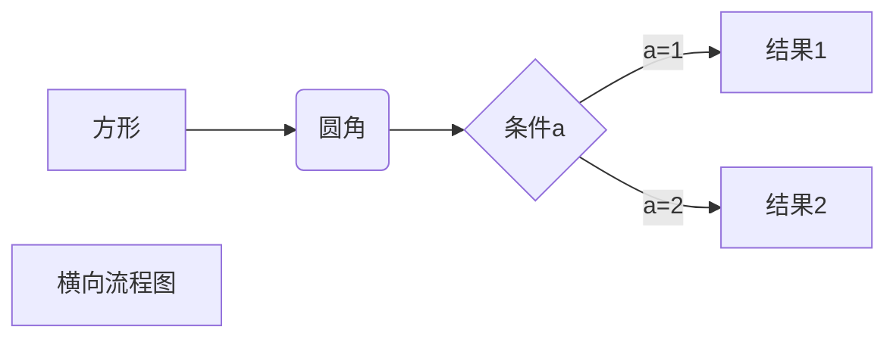

# Markdown 语法

## 一、Markdown 标题

### 1、使用 = 和 - 标记一级和二级标题

= 和 - 标记语法格式如下：

```
我展示的是一级标题
=================

我展示的是二级标题
-----------------
```

效果(保存变为 #我展示的是一级标题 ##我展示的是二级标题)

# 我展示的是一级标题

## 我展示的是二级标题

### 2、使用 # 号标记

使用 # 号可表示 1-6 级标题，一级标题对应一个 # 号，二级标题对应两个 # 号，以此类推。

```
# 一级标题
## 二级标题
### 三级标题
#### 四级标题
##### 五级标题
###### 六级标题
```

效果

# 一级标题

## 二级标题

### 三级标题

#### 四级标题

##### 五级标题

###### 六级标题

## 二、Markdown 段落格式

### 段落

Markdown 段落没有特殊的格式，直接编写文字就好，段落的换行是使用 <strong>两个以上空格</strong> 加上回车，也也可以在段落后面使用一个空行来表示重新开始一个段落。

### 字体

```
*斜体文本*
_斜体文本_
**粗体文本**
__粗体文本__
***粗斜体文本***
___粗斜体文本___

```

效果

_斜体文本_
_斜体文本_
**粗体文本**
**粗体文本**
**_粗斜体文本_**
**_粗斜体文本_**

### 分隔线

可以在一行中用三个以上的星号、减号、底线来建立一个分隔线，行内不能有其他东西。也可以在星号或是减号中间插入空格

```
***

* * *

*****

- - -

----------
```

效果

---

### 删除线

如果段落上的文字要添加删除线，只需要在文字的两端加上两个波浪线 ~~ 即可

RUNOOB.COM
GOOGLE.COM
~~BAIDU.COM~~

### 下划线

下划线可以通过 HTML 的 \<u> 标签来实现
<u>带下划线文本</u>

### 脚注

脚注是对文本的补充说明
[^要注明的文本]

创建脚注格式类似这样 [^runoob]。

[^runoob]: 菜鸟教程 -- 学的不仅是技术，更是梦想！！！

## 三、Markdown 列表

Markdown 支持有序列表和无序列表。

### 无序列表

无序列表使用星号(\*)、加号(+)或是减号(-)作为列表标记，这些标记后面要添加一个空格，然后再填写内容：

```
* 第一项
* 第二项
* 第三项

+ 第一项
+ 第二项
+ 第三项


- 第一项
- 第二项
- 第三项

```

- 第一项
- 第二项
- 第三项

* 第一项
* 第二项
* 第三项

### 有序列表

有序列表使用数字并加上 . 号来表示，如：

1. 第一项
2. 第二项
3. 第三项

### 列表嵌套

列表嵌套只需在子列表中的选项前面添加四个空格即可：

1. 第一项：
   - 第一项嵌套的第一个元素
   - 第一项嵌套的第二个元素
2. 第二项：
   - 第二项嵌套的第一个元素
   - 第二项嵌套的第二个元素



> 区块引用
> 菜鸟教程
> 学的不仅是技术更是梦想
