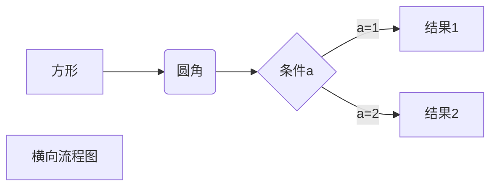

# Markdown 语法

## 一、Markdown 标题

### 1、使用 = 和 - 标记一级和二级标题

= 和 - 标记语法格式如下：

```
我展示的是一级标题
=================

我展示的是二级标题
-----------------
```

效果(保存变为 #我展示的是一级标题 ##我展示的是二级标题)

# 我展示的是一级标题

## 我展示的是二级标题

### 2、使用 # 号标记

使用 # 号可表示 1-6 级标题，一级标题对应一个 # 号，二级标题对应两个 # 号，以此类推。

```
# 一级标题
## 二级标题
### 三级标题
#### 四级标题
##### 五级标题
###### 六级标题
```

效果

# 一级标题

## 二级标题

### 三级标题

#### 四级标题

##### 五级标题

###### 六级标题

## 二、Markdown 段落格式

### 段落

Markdown 段落没有特殊的格式，直接编写文字就好，段落的换行是使用 <strong>两个以上空格</strong> 加上回车，也也可以在段落后面使用一个空行来表示重新开始一个段落。

### 字体

```
*斜体文本*
_斜体文本_
**粗体文本**
__粗体文本__
***粗斜体文本***
___粗斜体文本___

```

效果

_斜体文本_
_斜体文本_
**粗体文本**
**粗体文本**
**_粗斜体文本_**
**_粗斜体文本_**

### 分隔线

可以在一行中用三个以上的星号、减号、底线来建立一个分隔线，行内不能有其他东西。也可以在星号或是减号中间插入空格

```
***

* * *

*****

- - -

----------
```

效果

---

### 删除线

如果段落上的文字要添加删除线，只需要在文字的两端加上两个波浪线 ~~ 即可

RUNOOB.COM
GOOGLE.COM
~~BAIDU.COM~~

### 下划线

下划线可以通过 HTML 的 \<u> 标签来实现
<u>带下划线文本</u>

### 脚注

脚注是对文本的补充说明
[^要注明的文本]

创建脚注格式类似这样 [^runoob]。

[^runoob]: 菜鸟教程 -- 学的不仅是技术，更是梦想！！！

## 三、Markdown 列表

Markdown 支持有序列表和无序列表。

### 无序列表

无序列表使用星号(\*)、加号(+)或是减号(-)作为列表标记，这些标记后面要添加一个空格，然后再填写内容：

```
* 第一项
* 第二项
* 第三项

+ 第一项
+ 第二项
+ 第三项


- 第一项
- 第二项
- 第三项

```

- 第一项
- 第二项
- 第三项

* 第一项
* 第二项
* 第三项

### 有序列表

有序列表使用数字并加上 . 号来表示，如：

1. 第一项
2. 第二项
3. 第三项

### 列表嵌套

列表嵌套只需在子列表中的选项前面添加四个空格即可：

1. 第一项：
   - 第一项嵌套的第一个元素
   - 第一项嵌套的第二个元素
2. 第二项：
   - 第二项嵌套的第一个元素
   - 第二项嵌套的第二个元素

## 四、Markdown 区块

Markdown 区块引用是在段落开头使用 > 符号 ，然后后面紧跟一个空格符号：

> 区块引用
> 菜鸟教程
> 学的不仅是技术更是梦想

另外区块是可以嵌套的，一个 > 符号是最外层，两个 > 符号是第一层嵌套，以此类推：

```
> 最外层
> > 第一层嵌套
> > > 第二层嵌套
```

> 最外层
>
> > 第一层嵌套
> >
> > > 第二层嵌套

### 区块中使用列表

区块中使用列表实例如下：

```
> 区块中使用列表
> 1. 第一项
> 2. 第二项
> + 第一项
> + 第二项
> + 第三项
```

> 区块中使用列表
>
> 1. 第一项
> 2. 第二项
>
> - 第一项
> - 第二项
> - 第三项

### 列表中使用区块

如果要在列表项目内放进区块，那么就需要在 > 前添加四个空格的缩进。

列表中使用区块实例如下：

```
* 第一项
    > 菜鸟教程
    > 学的不仅是技术更是梦想
* 第二项
```

- 第一项
  > 菜鸟教程
  > 学的不仅是技术更是梦想
- 第二项

## 五、Markdown 代码

如果是段落上的一个函数或片段的代码可以用反引号把它包起来（`），例如：

`printf()` 函数

### 代码区块

代码区块使用 4 个空格或者一个制表符（Tab 键）。

    <?php
    echo 'xx';
    function test() {
       echo 'test'
    }

也可以用 ``` 包裹一段代码，并指定一种语言（也可以不指定）：

```javascript
$(document).ready(function () {
  alert("RUNOOB");
});
```

## 六、Markdown 链接

[链接名称](链接地址)

或者

<链接地址>

例如：这是一个链接 [百度](https://www.baidu.com)或<https://www.baidu.com>

### 高级链接

我们可以通过变量来设置一个链接，变量赋值在文档末尾进行：
这个链接用 1 作为网址变量 [Google][1]
这个链接用 runoob 作为网址变量 [Runoob][runoob]
然后在文档的结尾为变量赋值（网址）

[1]: http://www.google.com/
[runoob]: http://www.runoob.com/

## 七、Markdown 图片

Markdown 图片语法格式如下：


开头一个感叹号 !
接着一个方括号，里面放上图片的替代文字
接着一个普通括号，里面放上图片的网址，最后还可以用引号包住并加上选择性的 'title' 属性的文字。

使用实例：


当然，你也可以像网址那样对图片网址使用变量:
这个链接用 1 作为网址变量 [RUNOOB][1].
然后在文档的结尾为变量赋值（网址）

[1]: http://static.runoob.com/images/runoob-logo.png

Markdown 还没有办法指定图片的高度与宽度，如果你需要的话，你可以使用普通的  标签。


## 八、Markdown 表格

Markdown 制作表格使用 | 来分隔不同的单元格，使用 - 来分隔表头和其他行。

语法格式如下：

| 表头   | 表头   |
| ------ | ------ |
| 单元格 | 单元格 |
| 单元格 | 单元格 |

对齐方式

我们可以设置表格的对齐方式：

-: 设置内容和标题栏居右对齐。
:- 设置内容和标题栏居左对齐。
:-: 设置内容和标题栏居中对齐。

| 左对齐 | 右对齐 | 居中对齐 |
| :----- | -----: | :------: |
| 单元格 | 单元格 |  单元格  |
| 单元格 | 单元格 |  单元格  |

## 九、Markdown 高级技巧


