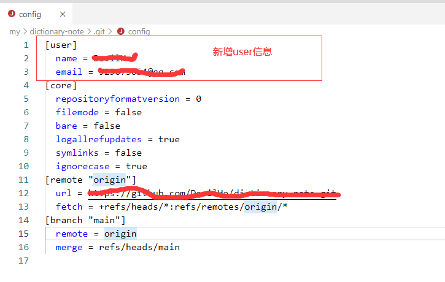

#### 场景：当你用不同电脑登录 git 之后，发现里面的名字会有不同，想修改下，以下两种方式可以修改

##### 1.修改 config 文件（仅本项目修改）

工作区根目录/.git/config，打开文件，然后修改



##### 2.git 命令行配置用户名和邮箱（全局修改）

```

git config --global user.name "xxxxx"

git config --global user.email "xxxxxxx"

```
